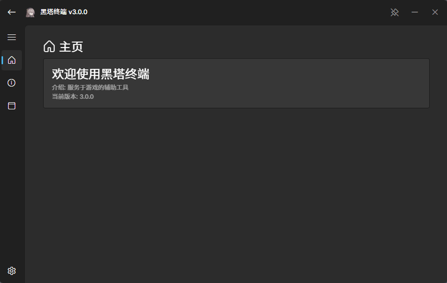

<h1 align="center">黑塔终端</h1>

> 对游戏进行自动化操作的辅助工具  
> 本项目将 [PyWebWinUI3](https://github.com/Haruna5718/PyWebWinUI3) 作为依赖且进行了修改

## 项目特点
- 现代的 WinUI3 风格设计
- 基于 Svelte 前端设计
- 自定义编写 XAML 设计自动化指令专属页面

## 运行要求
- Windows 10 1809+

## 获取 XAML 页面
- 你可以在本项目的 [XAML 文件夹](./XAML) 中获取到所有已编写的 XAML 页面

## 用户页面

## XAML 编写说明
- 详情请见[XAML 文档说明](./doc/make_xaml.md)

## 开发说明
- 详情请见[开发文档](./doc/develop.md)

## 对于原项目的改进
- 优化动画: frontend/src/lib/Page.svelte
- 添加发送命令功能: frontend/src/lib/Button.svelte
- 添加图片位置调整 align: frontend/src/lib/Image.svelte
- 优化动画/添加功能等改进: frontend/src/routes/+page.svelte

## 已归档项目
- [CODMW GUI II](https://github.com/SLSYSL/Herta-CODMW-GUI-II)

## 贡献者
- SLSYSL(LANREN)
- DusKal
- monocolotion
- MaymoN777(云影社区)

## 贡献
- 欢迎你提交 Pull requests 与 Issues

## 开源协议
本项目基于 [Apache License 2.0](http://www.apache.org/licenses/LICENSE-2.0) 许可证发行